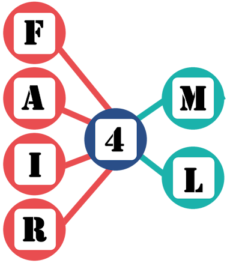

# FAIR4ML-schema 
[](https://www.repostatus.org/#wip) [](https://doi.org/10.5281/zenodo.14002310)




FAIR4ML metadata schema for describing machine learning model metadata. Source [discussion document](https://docs.google.com/spreadsheets/d/1WBvTXedKCKMTKc5ZGq4vonZPeSAq-JB28Nhdu1w3Rj8/edit#gid=0) (open for feedback)

The FAIR4ML vocabulary is available at `https://w3id.org/fair4ml#` with content negotiation.

To obtain the JSON-LD representation of the FAIR4ML vocabulary you may type:

```
curl -sH "Accept:application/ld+json" -L https://w3id.org/fair4ml 
```

To obtain a version, just replace the URL with the coresponding version IRI (e.g., [https://w3id.org/fair4ml/0.0.1](https://w3id.org/fair4ml/0.0.1)). You can see all available versions under the folder `releases`


## Documentation
The latest version of FAIR4ML is online at [https://w3id.org/fair4ml](https://w3id.org/fair4ml)

## Contributing
There are two different of contributing to this project:

1. [Opening issues](https://github.com/RDA-FAIR4ML/FAIR4ML-schema/issues) through our GitHub tracker. Please check which issues are already open before opening one.
2. Leave your comments in this [Google Sheet](https://docs.google.com/spreadsheets/d/16nU5zGPdqm07eEJscDwxF5wonOINuTanEBkszjtG10M/edit?usp=sharing), where the next releases are being discussed.

## Next releases
[FAIR4ML v0.1.0](https://w3id.org/fair4ml/0.1.0) is online. Next releases are being discussed to represent additional metadata such as metrics and evaluation results of a ML model, hyperparameter representation, model generation process or external validation of a model.

